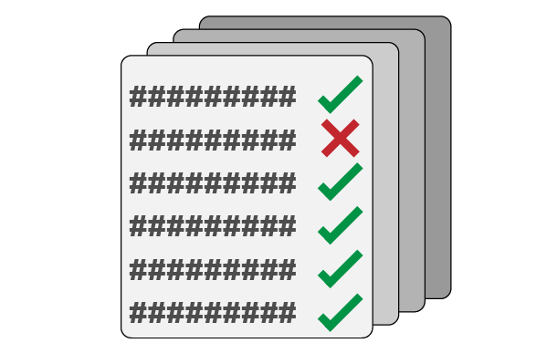

# VariantValidator Batch Validator

The VariantValidator Batch Validator allows multiple variant descriptions to be validated in a single submission through the VariantValidator web interface. It is designed for validating lists of variants generated from research, diagnostic, and clinical workflows.

If you only need to validate a single variant interactively, use the [Validator](validator.md) instead.

The Batch Validator accepts all VariantValidator supported input formats and processes submissions asynchronously. Results are returned by email once validation has completed.

## See also

- [Validator](validator.md) — Validate a single variant interactively.
- [Gene2Transcripts](gene2transcripts.md) — Identify suitable transcript reference sequences for a gene.
- [Supported Input Formats](../user-manual/reference/supported_inputs.md) — Complete list of accepted variant description formats.
- [Transcript Selection](../user-manual/reference/transcript_selection.md) — Guidance on selecting transcripts for validation.

---

# Opening the Batch Validator

The Validator can be accessed from the VVweb home page by:

- selecting **Try it out** on the **Batch Validator** card; 



<br clear="both"/>

or
- selecting **Tools → Batch Validator** from the navigation bar.

---

# Using the Batch Validator

Submitting variants using the Batch Validator consists of five simple steps:

1. Enter your variant descriptions into the **Input Variant Descriptions** box.
2. Optionally restrict validation to one or more genes using HGNC gene symbols.
3. Enter a valid email address.
4. Select the appropriate genome build.
5. Submit the job.

Validation results are processed in the order that jobs are received and are returned by email when complete.

## Preparing variant descriptions

The Batch Validator accepts all VariantValidator supported input formats. For a complete description of accepted formats, see [Supported Input Formats](../user-manual/reference/supported_inputs.md).

For clarity, the **web Batch Validator requires one variant description per line**. Multiple variants must not be entered on the same line.

If your variants are specified using gene symbols rather than transcript reference sequences, or you wish to restrict validation to particular transcripts, see [Transcript Selection](../user-manual/reference/transcript_selection.md).

When preparing variant lists, we recommend:

- Using a plain text editor whenever possible.
- Avoiding copying directly from formatted documents or web pages, which may introduce invisible characters.
- Ensuring that each variant description occupies a separate line.

A valid input file might contain:

```text
NM_000088.4:c.589G>T
NC_000017.10:g.48275363C>A
NG_007400.1:g.8638G>T
LRG_1:g.8638G>T
LRG_1t1:c.589G>T
17-50198002-C-A
chr17:50198002C>A
```

These variant descriptions are valid and should not generate validation errors.

The following examples contain errors and are expected to produce validation messages:

```text
NM_000088.4:c.589C>T
NC_000071.10:g.48275363C>A
NG_007400.2:g.8638G>T
LRG_1:g.8638G>N
LRG_1t3:c.589G>T
17-50198002-G-A
chr17:550198002C>A
COL5A1:c.5071A>T
NM_000088.3:c.589GG>CT
NM_000500.7:c.-107-19C>T
```

Example input files are available below:

- [valid_variant_test_set.txt](../static/files/valid_variant_test_set.txt)
- [invalid_variant_test_set.txt](../static/files/invalid_variant_test_set.txt)

---

# Customising the output

The Batch Validator allows you to customise the information included in the results file.

By default, all available output fields are returned. However, you may use the available checkboxes to include or exclude specific information depending on your workflow.

Customising the output can simplify downstream analysis by limiting the results to the information that is relevant to your application.

For a description of the available output fields, see [Output Formats](../user-manual/reference/output_formats.md).

---

# Submitting a job

When you submit a batch validation job, an on-screen confirmation message is displayed immediately. This confirmation includes a unique **Job ID**, for example:

```text
17e4fa8b-e4c3-4d1f-bfab-79c6366357e1
```

A confirmation email is also sent to the email address provided during submission. This email contains:

- the Request ID;
- the date and time the job was submitted; and
- confirmation that the request has entered the processing queue.

The time required to complete a job depends on:

- the number of variant descriptions submitted;
- the number of jobs currently waiting in the queue; and
- server workload.

When processing has completed, a second email is sent containing a secure link to download the results.

For security and storage reasons, results remain available for **seven days** after completion and are then permanently removed from the server.

---

# Understanding the results

Results are returned as a plain text, tab-delimited file.

Although the file is human-readable, it is intended to be opened in spreadsheet software such as Microsoft Excel or LibreOffice Calc. During import, the default tab-delimited settings are normally sufficient.

After opening the file, you may wish to adjust the column widths to improve readability.

Validation messages are reported in the **Warnings** column and may include:

- errors that prevent successful validation;
- warnings that provide additional guidance; or
- informational messages describing automatic corrections or other actions performed by VariantValidator.

If validation errors are reported, correct the affected variant descriptions and submit **only those variants requiring re-validation**.

For a complete description of validation messages, including recommended actions for each message, see [Errors and Error Codes](../user-manual/reference/errors_and_error_codes.md).

Example output files corresponding to the example input datasets can be downloaded below:

- [valid_variant_test_results.txt](../static/files/valid_variant_test_results.txt)
- [invalid_variant_test_results.txt](../static/files/invalid_variant_test_results.txt)

---

# Metadata

The Batch Validator automatically adds metadata to the second line of the output file. This metadata records information about the validation environment and includes details such as:

- the VariantValidator software version;
- database and reference data versions; and
- the output options selected for the validation job.

We recommend retaining this metadata when sharing or archiving validation results, as it can help reproduce analyses and assist with troubleshooting if support is required.

---

# Using the Batch Validator for journal submissions

Many biomedical journals now recommend or require variant descriptions to be validated before manuscript submission. VariantValidator is recognised by a number of journals as a suitable validation tool for this purpose.

When submitting to a journal that requires variant validation, include the Batch Validator output file alongside your manuscript if requested by the journal's submission guidelines.

> **Important**
>
> Any errors identified by VariantValidator, including variant descriptions that have been automatically corrected, should be reviewed and corrected in the manuscript before submission. VariantValidator reports validation issues but does not modify manuscript content.

Some journals may specify which output fields should be included in the submitted results. If you are unsure, we recommend leaving all output fields enabled when generating the results file.

For intronic variants, manuscripts should include either:

- a genomic sequence variant description; or
- a RefSeqGene sequence variant description, where an appropriate RefSeqGene record exists.

Following these recommendations helps ensure that published variant descriptions are unambiguous, reproducible, and compliant with HGVS nomenclature.

---

# Getting help

VariantValidator has been developed to support a wide range of users, from those new to HGVS nomenclature to experienced clinical scientists and bioinformaticians. If you encounter difficulties preparing variant descriptions or interpreting validation results, we encourage you to seek assistance.

Before contacting the development team, you may find the following documentation helpful:

- [Supported Input Formats](../user-manual/reference/supported_inputs.md)
- [Transcript Selection](../user-manual/reference/transcript_selection.md)
- [Errors and Error Codes](../user-manual/reference/errors_and_error_codes.md)

If you still require assistance, you can contact the VariantValidator team using our [contact form](https://variantvalidator.org/help/contact/).

Software bugs and feature requests can be reported through the [VariantValidator GitHub issue tracker](https://github.com/openvar/VariantValidator/issues).

---

# How to cite VariantValidator

If you use VariantValidator in your research, please [cite the appropriate VariantValidator publication(s)](https://github.com/openvar/VariantValidator#cite-us).

---

## Acknowledgements

**VariantValidator was originally developed at the University of Leicester (2016–2019). It is now maintained and developed by the University of Manchester, with continued hosting and development contributions from the University of Leicester.**


<br clear="both"/>