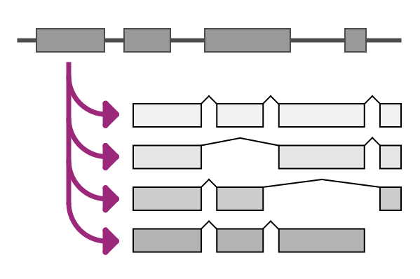

# Gene2Transcripts

Gene2Transcripts is part of the VariantValidator Web Interface (VVweb). It retrieves transcript information for genes and transcripts, helping you identify appropriate reference sequences before validating sequence variants.

The tool accepts HGNC gene symbols, transcript accessions and HGNC Gene IDs, returning comprehensive transcript information together with associated genomic, protein and gene annotations.

Gene2Transcripts is particularly useful when selecting an appropriate transcript for variant reporting or before validating variants with the [Validator](validator.md).

---

# Opening Gene2Transcripts

Gene2Transcripts can be accessed from the VVweb home page by:

- selecting **Try it out** on the **Gene2Transcripts** card.

 

or

- selecting **Tools → Gene2Transcripts** from the navigation bar.

---

# Entering a query

Gene2Transcripts accepts three different types of input:

- HGNC gene symbols (for example, `COL1A1`);
- transcript accessions (for example, `NM_000088.4`); or
- HGNC Gene IDs.

Enter a query into the search box and click **Submit**.

The returned report contains transcript information associated with the submitted gene or transcript.

---

## Limiting the returned transcripts

The optional **Limit the transcripts returned** field allows the results to be restricted to specific transcript groups.

For example, you may choose to return only:

- MANE transcripts;
- MANE Select transcripts;
- RefSeq Select transcripts; or
- other supported transcript collections.

This option is useful when you are interested in only a subset of the available transcript reference sequences.

For guidance on transcript selection strategies and the different transcript collections supported by VariantValidator, see [Transcript Selection](../user-manual/reference/transcript_selection.md).

---

## Selecting the transcript source

Gene2Transcripts supports two transcript sources:

- **RefSeq**
- **Ensembl**

RefSeq is the default transcript source and is recommended for most users.

Once all options have been selected, click **Submit**.

---

# Understanding the results

Gene2Transcripts returns a comprehensive report describing the available transcript reference sequences associated with the submitted gene or transcript.

Depending on the query, the report may include:

- transcript accessions;
- MANE Select status;
- MANE Plus Clinical status;
- HGNC identifiers;
- links to external reference resources.

Many entries within the report contain direct links to the original reference databases, allowing rapid access to supporting information.

---

# Choosing a transcript

Many genes have multiple transcript reference sequences.

Gene2Transcripts helps identify the most appropriate transcript for your application by presenting the available transcript metadata in a single report.

The most appropriate transcript depends on the intended use, such as clinical reporting, diagnostic testing or research.

For detailed guidance on transcript selection, including the use of MANE Select, MANE Plus Clinical and RefSeq Select transcripts, see [Transcript Selection](../user-manual/reference/transcript_selection.md).

---

# Using Gene2Transcripts with the Validator

Once an appropriate transcript has been identified, the transcript accession can be used directly with the [Validator](validator.md).

When validating variants, transcript accessions may be entered into the Validator transcript input field to restrict validation to one or more specific transcript reference sequences.

Multiple transcript accessions may be entered by separating them with the `|` character.

---

# Further Reading

The following documentation may also be useful:

- [Validator](validator.md)
- [Transcript Selection](../user-manual/reference/transcript_selection.md)
- [Supported Input Formats](../user-manual/reference/supported_inputs.md)
- [Errors and Error Codes](../user-manual/reference/errors_and_error_codes.md)

---

# How to cite VariantValidator

If you use VariantValidator in your research, please [cite the appropriate VariantValidator publication(s)](https://github.com/openvar/VariantValidator#cite-us).

---

## Acknowledgements

**VariantValidator was originally developed at the University of Leicester (2016–2019). It is now maintained and developed by the University of Manchester, with continued hosting and development contributions from the University of Leicester.**

 